# LocalRAG 数据流转流程图

> 本文档描绘 LocalRAG 一次「用户发问 → AI 回答」的完整数据流转。
> 所有流程图用 Mermaid 绘制(GitHub / VS Code Mermaid 插件可直接渲染箭头与分支)。
> 代码引用均标注 `文件:行号`,可点击跳转。
>
> 版本基线：v1.3.6

---

## 〇、系统大框架：端到端数据流（摄入 + 问答）

整个系统有**两条主线**，通过**本地向量库 + BM25 索引**这个持久化层连接：
- ① **文档摄入链路**（建库）：上传 → 解析 → 切分 → 向量化 → 入库
- ② **问答检索链路**（使用）：提问 → query 处理 → 混合检索 → rerank → LLM 作答

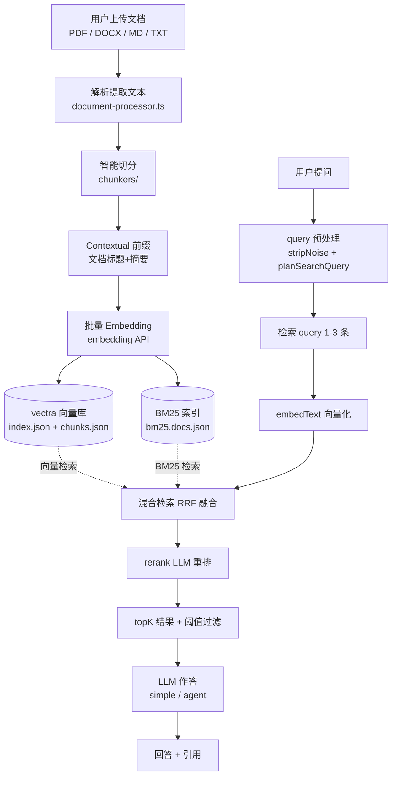

---

### 〇.1 文档摄入链路：怎么解析的

`document-processor.ts:429 processAndIndexDoc`

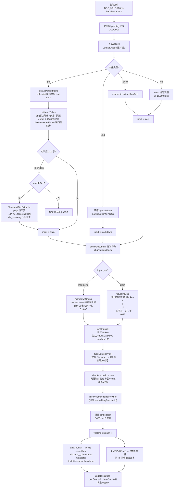

**解析要点**：

| 文件类型 | 解析方式 | 切分器 |
|---|---|---|
| PDF（文本层）| `pdfjs-dist` 拿带坐标 items → `pdfItemsToText` 按版面重排 + 跳页眉页脚 | recursive（A+C）|
| PDF（扫描件）| `pdfjs` 渲染页为 PNG → `tesseract.js` OCR（chi_sim+eng）| recursive（A+C）|
| Markdown | 读原始 md | markdown 结构感知（B+A+C，标题面包屑 + 代码块/表格原子化）|
| DOCX | `mammoth.extractRawText` | recursive（A+C）|
| TXT | `iconv-lite` 编码识别（utf-16/utf-8/gbk）| recursive（A+C）|

> 切分单位是 **token**（`gpt-tokenizer` cl100k_base），默认 `chunkSize=800 / chunkOverlap=100`。
> 每个 chunk 前会拼 **Contextual 前缀**（`【文档:文件名】+【摘要:首段200字】`），同份带前缀文本同时写入 vectra 和 BM25。

---

### 〇.2 向量化与存储：用什么向量数据库

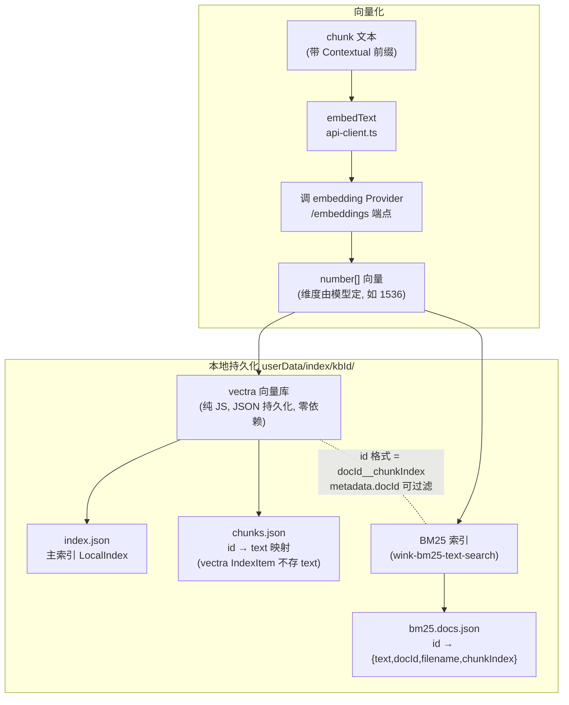

**为什么是 vectra + wink-bm25**：

- **vectra**（纯 JS 向量库）：替代了早期的 ChromaDB（需 Python 子进程）。JSON 文件持久化，零 native 编译，零外部运行时。每个 KB 一个目录 `userData/index/<kbId>/`。
  - `index.json`：主索引（向量 + metadata，`docId` 字段可过滤）
  - `chunks.json`：`id → text` 映射（因为 vectra 的 IndexItem 不存 text，单独存一份）
- **wink-bm25-text-search**：每个 KB 一份 `bm25.docs.json`，做精确术语（错误码、API 名、专有名词）召回。与 vectra 共用同一套 chunk id（`docId__chunkIndex`），便于 RRF 融合对齐。
- **sql.js**（纯 WASM SQLite）：存对话历史、文档元数据、session 摘要（`chat.db`）。
- **keytar**：API Key 存 Windows 凭据管理器，不明文落盘。

> **零外部运行时**：无 Python / 无 Docker / 无 native 编译（sql.js 是 WASM，vectra/wink 是纯 JS）。打包后安装即用。

---

### 〇.3 问答检索链路：topK 结果怎么来

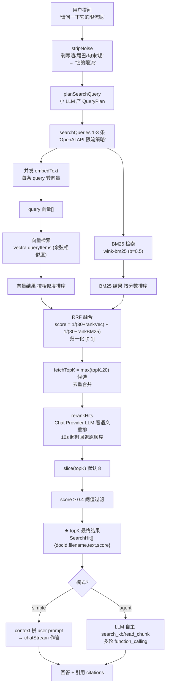

**检索关键参数**：

| 参数 | 默认值 | 作用 |
|---|---|---|
| `topK` | 8 | 最终给 LLM 的 chunk 数 |
| `fetchK` | max(50, 10×topK) | RRF 融合前的候选池大小 |
| `RRF_K` | 30 | RRF 融合常数，越小低 rank 衰减越快 |
| `bm25 b` | 0.5 | BM25 length norm 力度（弱化长 chunk 优势）|
| `citationScoreThreshold` | 0.4 | 分数阈值，低于此分的 chunk 剔除（0 关闭）|
| `enableRerank` | true | LLM 语义重排（救回被 RRF 排到 topK 外的正确答案）|

---

## 一、总览：从用户输入到 AI 输出

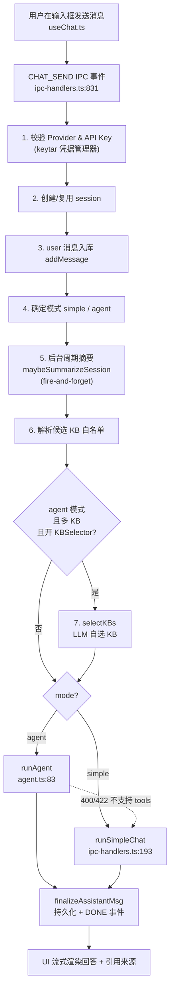

---

## 二、入口阶段：CHAT_SEND（两种模式共用前置）

`ipc-handlers.ts:831`

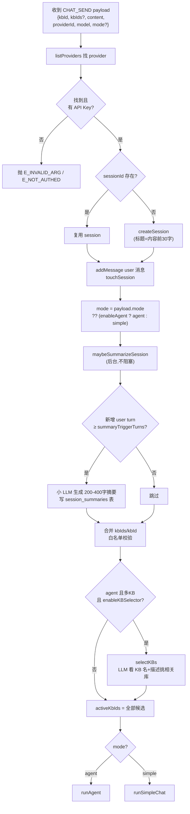

---

## 三、简单模式数据流：runSimpleChat

`ipc-handlers.ts:193`

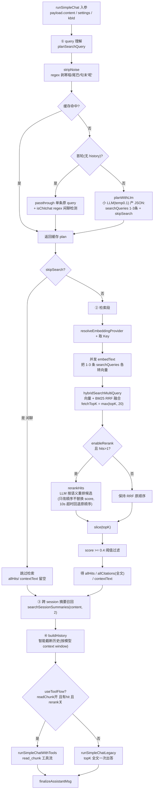

### 简单模式 · 各步数据形态


---

## 四、Agent 模式数据流：runAgent

`agent.ts:83` — LLM 通过 function_calling 自主决定搜不搜、搜什么、搜几次。

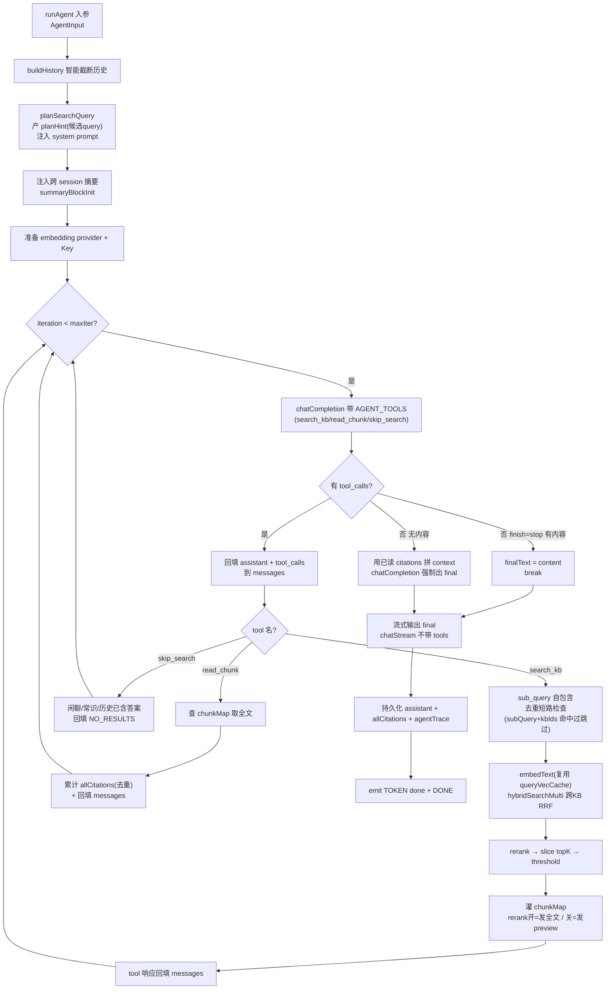

### Agent 模式 · 单次循环数据形态

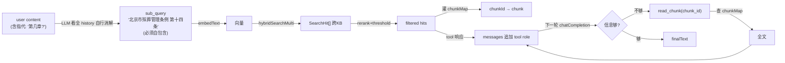

---

## 五、检索内部数据流（向量 + BM25 RRF 融合）

`vector-store.ts` — `hybridSearch` / `hybridSearchMulti` / `hybridSearchMultiQuery`

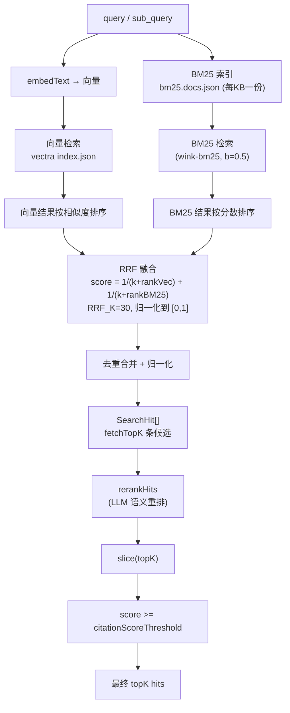

> **关键参数**：topK 默认 8 / fetchK = max(50, 10×topK) / RRF_K = 30 / BM25 b = 0.5 / citationScoreThreshold = 0.4

---

## 六、history 构造数据流（context-builder.ts:90）

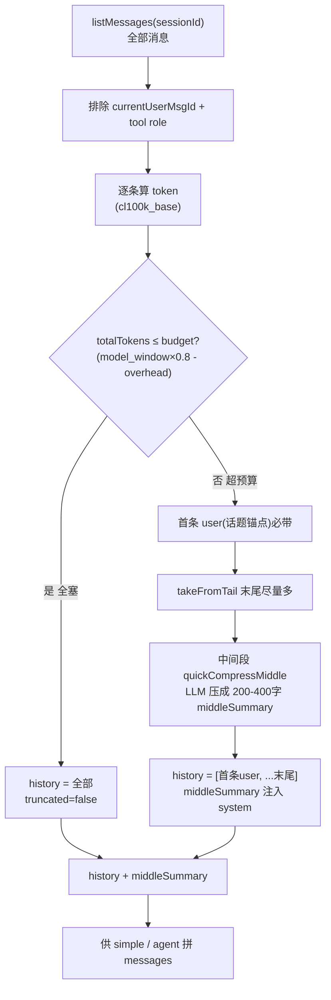

---

## 七、read_chunk 工具流数据流（简单模式 rerank 关闭时）

`runSimpleChatWithTools` `ipc-handlers.ts:389`

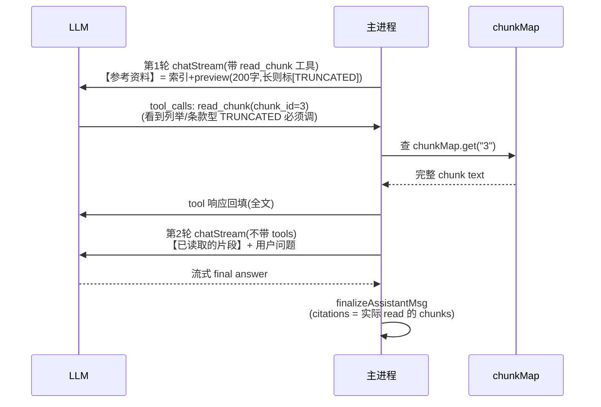

---

## 八、UI 事件流（主进程 → 渲染进程）

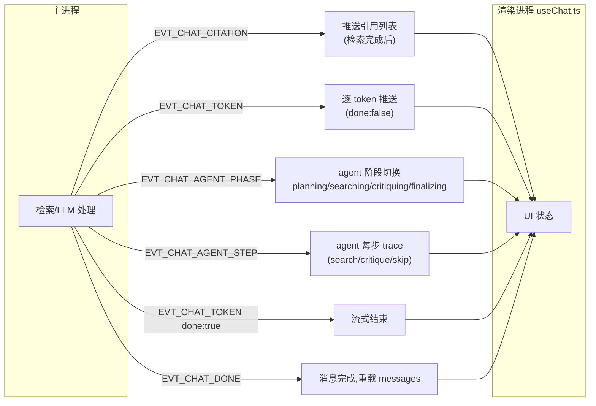

---

## 九、简单模式 vs Agent 模式 对照

| 维度 | 简单模式 | Agent 模式 |
|---|---|---|
| 检索决策 | 固定：planSearchQuery 改写 → 一次检索 | LLM 自主：可多次 search_kb / 可 skip |
| 检索 query | 改写管线产 1-3 条 RRF 融合 | LLM 输出 sub_query（planHint 仅参考） |
| 跨 KB | 单 KB（candidateKbIds[0]） | 多 KB（selectKBs 自选 + hybridSearchMulti） |
| 中间步 | 最多 1 轮 read_chunk | 最多 maxIterations（默认 4）轮 |
| 可观测 | timing 日志 | agentTrace 折叠面板 |
| 降级 | Provider 不支持 tools → legacy 全文 | 400/422 → 降级 simple |

---

## 附：Mermaid 渲染说明

本文档内所有 ```mermaid 代码块在以下环境可直接渲染为带箭头的流程图：

- **GitHub**：原生支持,推送到仓库后自动渲染
- **VS Code**：安装 `Markdown Preview Mermaid Support` 插件
- **Typora / Obsidian**：原生支持
- **命令行导出图片**：`npx @mermaid-js/mermaid-cli -i 流程图.md -o flow.svg`（需先 `npm i -D @mermaid-js/mermaid-cli`）
